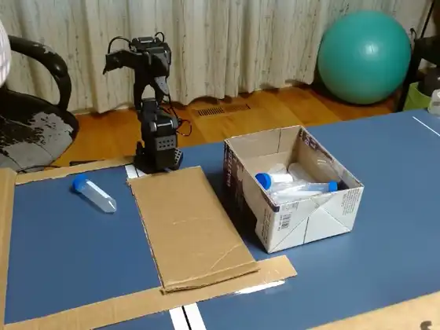

# SO-101: Imitation Learning → Reinforcement Learning on a Real Robot Arm

Teaching a 5-DOF desk robot arm to pick up a tube — first by imitation, then by
reinforcement learning — on physical hardware, end to end.

<p align="center">
  
  <br>
  <em>One teleoperated demonstration from the training dataset (side camera).<br>
  An ACT policy trained on these 118 episodes reaches 96.7% success over 30 trials.</em>
</p>

This is a working fork of [🤗 LeRobot](https://github.com/huggingface/lerobot) containing a
single hobbyist's research project: the tooling built along the way, sixteen fixes to the
upstream RL stack, and a written record of what worked and what didn't.

| | |
|---|---|
| **Robot** | SO-101 (5-DOF, two cameras: wrist + side) |
| **Task** | "Grab the tube" — pick a tube from a mat, drop it in a bin |
| **Best real-hardware result** | **96.7%** success (29/30) with ACT |
| **Dataset** | [`Atomictan/grab_tube_merged_v3`](https://huggingface.co/datasets/Atomictan/grab_tube_merged_v3) — 118 episodes, public |
| **Upstream README** | [UPSTREAM_README.md](./UPSTREAM_README.md) |

## Results

**Imitation learning (ACT), real hardware — 40% → 96.7%.**
Three cycles of *evaluate → diagnose → collect → retrain*, changing only the data.
Architecture, hyperparameters and hardware were held constant.

| Policy | Episodes | Success | Protocol |
|--------|---------:|--------:|----------|
| v2 | 50 | 40% | 20 trials |
| v3 | 75 | 60% | 2×20 trials |
| v4 | 107 | 82.5% | 2×20 trials |
| **v5** | **118** | **96.7%** | 30 trials |

**Reinforcement learning (SAC / HIL-SERL).**
The pipeline is validated: in simulation it solved a pick task unattended with zero human
intervention, 0% → 100% over 1,104 episodes. The learning curve turned out to be the most
useful artifact of the whole project:

```
ep    1-138    4.3% success   ← flat for ~26,000 transitions
ep  139-276    3.6%
ep  277-414   52.9%           ← phase transition
ep  415-552  100.0%
```

RL improves as a **phase transition, not a gradient**. A run killed at episode 250 looks
identical to one that will never work. This also explained the stalled real-robot run: at
~2,600 transitions it hadn't failed — it hadn't started.

Full write-ups: **[PROJECT_LOG.md](./scripts/learning/PROJECT_LOG.md)** (all three phases)
and **[GRASP_IMPROVEMENT_SUMMARY.md](./scripts/learning/GRASP_IMPROVEMENT_SUMMARY.md)**
(the 40→96.7% methodology in detail).

## What's here

Everything project-specific lives in [`scripts/learning/`](./scripts/learning/):

| File | Purpose |
|------|---------|
| `evaluate_policy.py` | Scored eval harness — keyboard start/stop, failure collection |
| `label_reward.py` | Motor-signal labelling rule → `next.reward` |
| `crop_dataset.py` | Crop/scale to the 128×128 the reward classifier requires |
| `eval_reward_classifier.py` | Per-frame P/R sweep + episode-level scoring |
| `build_offline_buffer.py` | Demonstrations → bounds-consistent offline replay buffer |
| `urdf_grid_check.py` | Validate URDF scale against a printed grid (Umeyama fit) |
| `gripper_sign_check.py` | Hardware check for gripper action polarity |
| `push_dataset_to_hub.py` | Publish the dataset with its card |
| `hilserl_grab_tube.json` | Real-arm actor/learner config |
| `gym_hil_pickcube.json` | Sim config that validated the RL pipeline |

## Fixes to upstream LeRobot

Sixteen defects found by running the RL stack against real hardware, where the
keyboard-intervention and checkpointing paths see far less use than the gamepad and
logging paths the rest of the code assumes. **Most raised no error at all:**

- **Resume fed the encoder images 255× darker.** `make_dataset()` yields uint8 `[0,255]`,
  but the resume path's bare `LeRobotDataset` yields float32 `[0,1]`. A resumed run
  silently trained on near-black images.
- **Replay-buffer dumps contained no images.** `to_lerobot_dataset()` passed float images
  to a writer that accepts float only in `[0,1]`; every frame failed, producing an
  unusable resume that surfaced only much later.
- **Convergence metrics were computed and discarded.** Episodic reward and intervention
  rate never printed unless an external logging service was enabled — so the two numbers
  that show whether HIL-SERL is working were invisible.
- **Released keys cancelled held keys.** Human intervention derived movement from *every*
  key ever pressed, so a stale release zeroed an active press, with dict insertion order
  deciding the winner.

See [`PROJECT_LOG.md`](./scripts/learning/PROJECT_LOG.md#4-sixteen-fixes-to-the-library-itself)
for the full list.

## Setup

Standard LeRobot installation from source — see [UPSTREAM_README.md](./UPSTREAM_README.md).
The project scripts additionally expect an SO-101 URDF and meshes; paths are set at the top
of `build_offline_buffer.py` and `urdf_grid_check.py`.

## License

Apache-2.0, as upstream. LeRobot is © Hugging Face and its contributors; this fork's
additions are under the same license.
